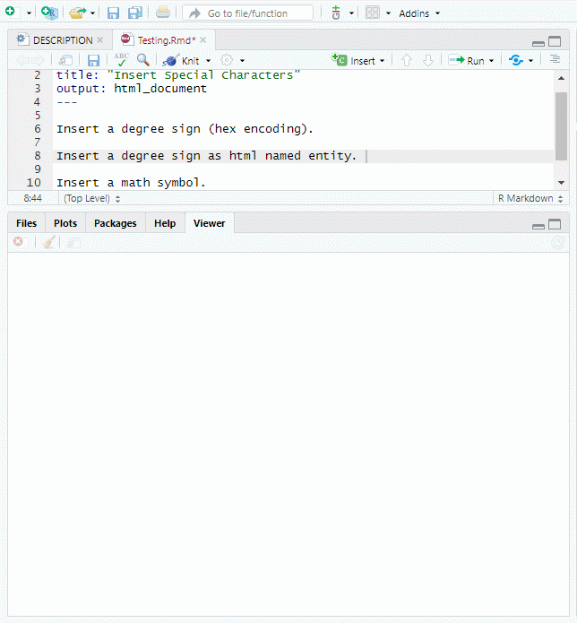

This is a RStudio addin for inserting special characters, similar to the "Insert Symbol" function in Microsoft Office. All special characters in the [W3C character reference](https://dev.w3.org/html5/html-author/charref) are included. 

# Usage

To insert a symbol:

1. Search for desired symbol through selecting a "character set" or the option "All" to show all symbols.

2. Choose the encoding desired.

3. Click on the symbol, and then on the "insert" button at the top to confirm insertion. Insertion occurs where the cursor is placed.

Click the "help" link within the addin to show help. 
